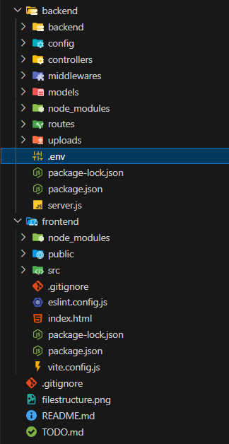

# 🛍️ E-Commerce Platform with Admin Panel

A full-stack e-commerce application built with the MERN stack, featuring a comprehensive admin panel for managing products, orders, and users. The platform provides a seamless shopping experience with secure authentication, payment processing, and advanced product management capabilities.

## 🚀 Introduction

This e-commerce platform is designed to provide a complete online shopping solution with both customer-facing and administrative functionalities. Built using modern web technologies, it offers a responsive, secure, and scalable architecture suitable for businesses of all sizes.

### Key Features
- **User Authentication & Authorization**: Secure login/registration with JWT tokens
- **Product Management**: Comprehensive CRUD operations for products with image uploads
- **Shopping Cart & Checkout**: Full e-commerce workflow with Stripe payment integration
- **Admin Dashboard**: Complete administrative control over products, orders, and users
- **Order Management**: Track and manage customer orders
- **User Profiles**: Personalized user accounts with order history
- **Responsive Design**: Mobile-first approach with Tailwind CSS
- **Image Management**: Cloudinary integration for optimized image handling
- **Security Features**: Helmet, rate limiting, and input validation

## ⚡ Features

### User Features
- **Account Management**
  - User registration and login
  - Password reset functionality
  - Profile management
  - Order history tracking

- **Shopping Experience**
  - Product browsing and search
  - Product filtering by category
  - Detailed product pages
  - Shopping cart management
  - Secure checkout process
  - Order tracking

- **Additional Capabilities**
  - Wishlist functionality
  - Product reviews and ratings
  - Email notifications
  - Responsive design for all devices

### Admin Features
- **Dashboard Overview**
  - Sales analytics and metrics
  - Recent orders summary
  - Inventory status
  - User statistics

- **Product Management**
  - Add, edit, delete products
  - Bulk product operations
  - Image upload and management
  - Category and subcategory management
  - Stock level monitoring
  - Featured product management

- **Order Management**
  - View all customer orders
  - Order status updates
  - Order details and tracking
  - Revenue tracking

- **User Management**
  - View and manage user accounts
  - User role management
  - Customer support tools

## 🔄 Working Flow

### Customer Journey
1. **Registration/Login**: Users create accounts or log in securely
2. **Product Discovery**: Browse products by category, search, or filters
3. **Product Selection**: View detailed product information and add to cart
4. **Cart Management**: Review and modify cart items
5. **Checkout Process**: Secure payment processing with Stripe
6. **Order Confirmation**: Receive order confirmation and tracking information
7. **Profile Management**: Access order history and manage account details

### Admin Workflow
1. **Login**: Admin authentication with elevated privileges
2. **Dashboard Review**: Monitor key metrics and recent activity
3. **Product Management**: Add new products, update existing ones, manage inventory
4. **Order Processing**: Review and update order statuses
5. **User Management**: Oversee customer accounts and resolve issues
6. **Analytics Review**: Analyze sales data and platform performance

## 📂 File Structure



```
ecommerce-platform/
├── backend/                    # Backend application
│   ├── config/                # Configuration files
│   │   ├── cloudinary.js      # Cloudinary image service config
│   │   ├── database.js        # MongoDB connection config
│   │   └── multer.js          # File upload configuration
│   ├── controllers/           # Route controllers
│   │   ├── adminController.js # Admin-specific logic
│   │   ├── authController.js  # Authentication logic
│   │   ├── orderController.js # Order management
│   │   ├── productController.js # Product operations
│   │   └── userController.js  # User management
│   ├── middlewares/           # Express middlewares
│   │   ├── adminAuth.js       # Admin authentication
│   │   ├── auth.js            # User authentication
│   │   └── errorHandler.js    # Error handling
│   ├── models/                # MongoDB models
│   │   ├── Order.js           # Order schema
│   │   ├── Product.js         # Product schema
│   │   └── User.js            # User schema
│   ├── routes/                # API routes
│   │   ├── adminRoutes.js     # Admin endpoints
│   │   ├── authRoutes.js      # Authentication endpoints
│   │   ├── orderRoutes.js     # Order endpoints
│   │   ├── productRoutes.js   # Product endpoints
│   │   └── userRoutes.js      # User endpoints
│   ├── uploads/               # File upload directory
│   ├── package.json           # Backend dependencies
│   └── server.js              # Main server file
├── frontend/                  # Frontend application
│   ├── public/                # Static assets
│   ├── src/                   # Source code
│   │   ├── api/               # API configuration
│   │   │   └── api.js         # Axios instance with interceptors
│   │   ├── components/        # Reusable components
│   │   │   ├── AdminRoute.jsx # Admin route protection
│   │   │   ├── ErrorBoundary.jsx # Error boundary component
│   │   │   ├── LoadingSpinner.jsx # Loading indicator
│   │   │   ├── Navbar.jsx     # Navigation component
│   │   │   └── ProtectedRoute.jsx # User route protection
│   │   ├── context/           # React context providers
│   │   │   ├── AuthContext.jsx # Authentication context
│   │   │   └── CartContext.jsx # Shopping cart context
│   │   ├── pages/             # Page components
│   │   │   ├── admin/         # Admin pages
│   │   │   │   ├── AdminDashboard.jsx
│   │   │   │   ├── AdminOrders.jsx
│   │   │   │   ├── AdminProducts.jsx
│   │   │   │   └── AdminUsers.jsx
│   │   │   ├── Cart.jsx       # Shopping cart page
│   │   │   ├── Checkout.jsx   # Checkout page
│   │   │   ├── Home.jsx       # Home page
│   │   │   ├── Login.jsx      # Login page
│   │   │   ├── Orders.jsx     # Orders page
│   │   │   ├── ProductDetails.jsx # Product details page
│   │   │   ├── Products.jsx   # Products listing page
│   │   │   ├── Profile.jsx    # User profile page
│   │   │   └── Register.jsx   # Registration page
│   │   └── App.jsx            # Main application component
│   ├── package.json           # Frontend dependencies
│   ├── vite.config.js         # Vite configuration
│   └── index.html             # HTML template
├── README.md                  # Project documentation
└── TODO.md                    # Development tasks
```

## 🛠️ Tech Stack & Dependencies

### Backend Technologies
- **Runtime**: Node.js
- **Framework**: Express.js
- **Database**: MongoDB with Mongoose ODM
- **Authentication**: JSON Web Tokens (JWT)
- **File Upload**: Multer
- **Image Management**: Cloudinary
- **Payment Processing**: Stripe
- **Email Service**: Nodemailer
- **Security**: Helmet, CORS, Rate Limiting
- **Validation**: Express Validator

### Frontend Technologies
- **Framework**: React 19
- **Build Tool**: Vite
- **Styling**: Tailwind CSS
- **Routing**: React Router DOM
- **HTTP Client**: Axios
- **Icons**: Heroicons & Lucide React
- **UI Components**: Headless UI

### Development Tools
- **Code Quality**: ESLint
- **Process Management**: Nodemon (backend)
- **Version Control**: Git

## 📦 Installation / Setup Instructions

### Prerequisites
- Node.js (v18 or higher)
- MongoDB (local installation or MongoDB Atlas)
- Git

### Backend Setup
1. **Navigate to backend directory**
   ```bash
   cd backend
   ```

2. **Install dependencies**
   ```bash
   npm install
   ```

3. **Environment Configuration**
   Create a `.env` file in the backend directory with the following variables:
   ```env
   NODE_ENV=development
   PORT=5000
   MONGODB_URI=your_mongodb_connection_string
   JWT_SECRET=your_jwt_secret_key
   FRONTEND_URL=http://localhost:5173
   CLOUDINARY_CLOUD_NAME=your_cloudinary_cloud_name
   CLOUDINARY_API_KEY=your_cloudinary_api_key
   CLOUDINARY_API_SECRET=your_cloudinary_api_secret
   STRIPE_SECRET_KEY=your_stripe_secret_key
   EMAIL_USER=your_email@gmail.com
   EMAIL_PASS=your_email_app_password
   ```

4. **Start the development server**
   ```bash
   npm run dev
   ```

### Frontend Setup
1. **Navigate to frontend directory**
   ```bash
   cd frontend
   ```

2. **Install dependencies**
   ```bash
   npm install
   ```

3. **Environment Configuration**
   Create a `.env` file in the frontend directory:
   ```env
   VITE_API_URL=http://localhost:5000/api
   ```

4. **Start the development server**
   ```bash
   npm run dev
   ```

5. **Access the application**
   - Frontend: http://localhost:5173
   - Backend API: http://localhost:5000

## 🔹 NPM Packages

### Backend Dependencies
```json
{
  "express": "^4.18.2",
  "mongoose": "^8.0.3",
  "bcrypt": "^5.1.1",
  "jsonwebtoken": "^9.0.2",
  "multer": "^1.4.5-lts.1",
  "cloudinary": "^1.41.0",
  "cors": "^2.8.5",
  "dotenv": "^16.3.1",
  "stripe": "^14.9.0",
  "nodemailer": "^6.9.7",
  "express-rate-limit": "^7.1.5",
  "helmet": "^7.1.0",
  "express-validator": "^7.0.1"
}
```

### Frontend Dependencies
```json
{
  "@headlessui/react": "^2.2.8",
  "@heroicons/react": "^2.2.0",
  "@tailwindcss/vite": "^4.1.13",
  "axios": "^1.12.2",
  "lucide-react": "^0.544.0",
  "react": "^19.1.1",
  "react-dom": "^19.1.1",
  "react-router-dom": "^7.9.1",
  "tailwindcss": "^4.1.13"
}
```

## 🚧 Future Improvements

### Technical Enhancements
- **Performance Optimization**
  - Implement Redis caching for frequently accessed data
  - Add database indexing for improved query performance
  - Optimize image loading with lazy loading and progressive JPEGs

- **Security Improvements**
  - Implement two-factor authentication (2FA)
  - Add API versioning for better maintainability
  - Enhance input sanitization and validation

- **Scalability Features**
  - Containerize the application with Docker
  - Implement microservices architecture for better separation of concerns
  - Add load balancing for high-traffic scenarios

### Feature Additions
- **Advanced Analytics**
  - Customer behavior tracking
  - Advanced sales reporting
  - Inventory forecasting

- **Enhanced User Experience**
  - Real-time chat support
  - Product recommendation engine
  - Social media integration

- **Mobile Application**
  - React Native mobile app
  - Push notifications for orders
  - Offline functionality

### Integration Opportunities
- **Third-party Services**
  - Integration with additional payment gateways
  - Shipping provider APIs
  - Social login options (Google, Facebook)

- **AI/ML Features**
  - Personalized product recommendations
  - Chatbot for customer support
  - Image search functionality

---

**Note**: This project is actively maintained and updated. For the latest features and improvements, please check the repository regularly.
