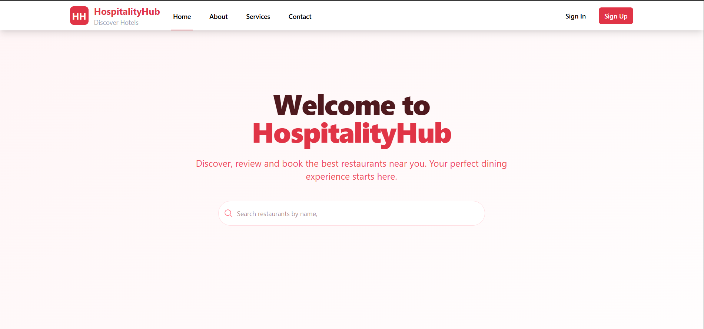

# HospitalityHub

[](https://github.com/ABHAYBARMAN067/hospitality-management-system)

A full-stack web application for managing restaurants, bookings, menus, orders, and user interactions in a hospitality setting.


# Screenshot



## Features

- **User Authentication**: Register and login with JWT-based authentication (7-day sessions).
- **Restaurant Management**: Admins can add, view, and manage their restaurants with details like name, address, contact, and images.
- **Menu Management**: Create and manage restaurant menus with items, prices, and descriptions.
- **Order Management**: Users can place orders from restaurant menus, and admins can manage order statuses.
- **Table Bookings**: Users can book tables, and admins can approve or reject bookings.
- **Admin Dashboard**: Comprehensive dashboard for admins to oversee restaurants, bookings, and orders with tabbed interface for managing table bookings and orders.
- **Review System**: Users can leave reviews for restaurants.
- **Image Upload**: Cloudinary integration for uploading restaurant and menu images.
- **Responsive UI**: Built with React and Tailwind CSS for a modern, responsive interface.
- **Dark Mode Support**: UI supports light and dark themes.
- **Real-time Notifications**: Toast notifications for user actions and feedback.

## Tech Stack

### Frontend
- React (with Vite)
- React Router DOM
- Axios
- Tailwind CSS
- Lucide React (for icons)

### Backend
- Node.js
- Express.js
- MongoDB (with Mongoose)
- JWT (JSON Web Tokens)
- Bcryptjs (for password hashing)
- Multer (for file uploads)
- Cloudinary (for image storage)
- CORS

### Dev Tools
- Nodemon (for backend development)
- ESLint (for code linting)

## Installation

1. **Clone the repository**:
   ```bash
   git clone <https://github.com/ABHAYBARMAN067/hospitality-management-system>
   cd hospitality-management-system
   ```

2. **Install backend dependencies**:
   ```bash
   cd backend
   npm install
   ```
   **Backend Dependencies:**
   - `bcryptjs`: Password hashing
   - `cloudinary`: Image storage and management
   - `cors`: Cross-origin resource sharing
   - `dotenv`: Environment variable management
   - `express`: Web framework
   - `jsonwebtoken`: JWT token handling
   - `mongoose`: MongoDB ODM
   - `multer`: File upload handling
   - `react-router-dom`: Routing (note: should be in frontend)
   - `uuid`: Unique identifier generation

   **Backend Dev Dependencies:**
   - `nodemon`: Development server with auto-restart

3. **Install frontend dependencies**:
   ```bash
   cd ../frontend
   npm install
   ```
   **Frontend Dependencies:**
   - `@headlessui/react`: Headless UI components
   - `@heroicons/react`: Heroicons for React
   - `@tailwindcss/vite`: Tailwind CSS Vite plugin
   - `axios`: HTTP client for API calls
   - `classnames`: Conditional CSS classes
   - `dotenv`: Environment variables
   - `framer-motion`: Animation library
   - `react`: React library
   - `react-dom`: React DOM rendering
   - `react-hot-toast`: Toast notifications
   - `react-icons`: Icon library
   - `react-router-dom`: Client-side routing
   - `react-toastify`: Toast notifications

   **Frontend Dev Dependencies:**
   - `@eslint/js`: ESLint JavaScript configuration
   - `@types/react`: React TypeScript types
   - `@types/react-dom`: React DOM TypeScript types
   - `@vitejs/plugin-react`: Vite React plugin
   - `autoprefixer`: CSS vendor prefixing
   - `eslint`: Code linting
   - `eslint-plugin-react-hooks`: React hooks linting
   - `eslint-plugin-react-refresh`: React fast refresh linting
   - `globals`: Global variables for ESLint
   - `postcss`: CSS processing
   - `tailwindcss`: Utility-first CSS framework
   - `vite`: Build tool and dev server

4. **Set up environment variables**:
   - Create a `.env` file in the `backend` directory with the following variables:
     ```
     PORT=5000
     NODE_ENV=development
     MONGODB_URI=mongodb://localhost:27017/hospitality-management-system
     JWT_SECRET=your-jwt-secret
     CLOUDINARY_CLOUD_NAME=your-cloudinary-cloud-name
     CLOUDINARY_API_KEY=your-cloudinary-api-key
     CLOUDINARY_API_SECRET=your-cloudinary-api-secret
     ```
   - Note: For production, use a MongoDB Atlas URI or other database.

5. **Start MongoDB**:
   - Ensure MongoDB is running locally on port 27017, or update `MONGODB_URI` accordingly.

## Usage

### Running with Microservices Architecture

1. **Start individual services** (recommended for development):
   ```bash
   # Terminal 1: Auth Service
   cd backend/services/auth
   npm run dev  # Runs on port 5001

   # Terminal 2: Restaurant Service
   cd backend/services/restaurant
   npm run dev  # Runs on port 5002

   # Terminal 3: Booking Service
   cd backend/services/booking
   npm run dev  # Runs on port 5003
   ```

2. **Start the frontend development server**:
   ```bash
   cd frontend
   npm run dev
   ```
   The app will be available at `http://localhost:5173`.

3. **Access the application**:
   - Open your browser and go to `http://localhost:5173`.
   - Register a new account or login.
   - Admins can access `/admin/dashboard` to manage restaurants and bookings.

### Alternative: Running Monolithic Backend

If you prefer to run the original monolithic backend:
```bash
cd backend
npm run dev  # Runs on port 5000
```
## Project Structure

```
hospitality-management-system/
├── backend/                       # Node.js/Express backend
│   ├── config/
│   │   ├── cloudinary.js          # Cloudinary configuration for image uploads
│   │   └── database.js            # MongoDB connection setup
│   ├── controllers/
│   │   ├── adminController.js     # Admin dashboard and booking management logic
│   │   ├── authController.js      # User authentication (register, login, logout, session)
│   │   ├── menuController.js      # Menu item CRUD operations
│   │   ├── orderController.js     # Order management logic
│   │   ├── restaurantController.js # Restaurant management logic
│   │   └── reviewController.js    # Review system logic
│   ├── middlewares/
│   │   ├── adminAuth.js           # Admin role verification middleware
│   │   ├── auth.js                # JWT token verification middleware
│   │   └── fileUpload.js          # Multer configuration for file uploads
│   ├── models/
│   │   ├── Booking.js             # Table booking schema
│   │   ├── MenuItem.js            # Menu item schema
│   │   ├── Order.js               # Order schema
│   │   ├── Restaurant.js          # Restaurant schema
│   │   ├── Review.js              # Review schema
│   │   ├── TableBooking.js        # Table booking schema
│   │   └── User.js                # User authentication schema
│   ├── routes/
│   │   ├── admin.js               # Admin dashboard routes
│   │   ├── auth.js                # Authentication routes
│   │   ├── bookings.js            # Booking management routes
│   │   ├── menu.js                # Menu management routes
│   │   ├── orders.js              # Order management routes
│   │   ├── restaurants.js         # Restaurant CRUD routes
│   │   └── reviews.js             # Review system routes
│   ├── .gitignore
│   ├── index.js                   # Main backend server entry point
│   ├── package.json
│   ├── package-lock.json
│   └── README.md
├── frontend/                      # React frontend
│   ├── .gitignore
│   ├── eslint.config.js           # ESLint configuration
│   ├── index.html                 # Main HTML file
│   ├── package.json
│   ├── package-lock.json
│   ├── tailwind.config.js         # Tailwind CSS configuration
│   ├── vite.config.js             # Vite build configuration
│   ├── public/
│   │   └── vite.svg               # Public assets
│   └── src/
│       ├── api/
│       │   └── api.js             # Axios API configuration
│       ├── assets/
│       │   ├── react.svg          # React logo
│       │   └── screenshot/
│       │       └── image.png      # App screenshot
│       ├── components/
│       │   ├── About.jsx          # About page component
│       │   ├── AdminDashboard.jsx # Admin dashboard with bookings
│       │   ├── Contact.jsx        # Contact page component
│       │   ├── Home.jsx           # Home page component
│       │   ├── HotelsDetail.jsx   # Hotel details component
│       │   ├── Login.jsx          # Login form component
│       │   ├── MenuManagement.jsx # Menu management component
│       │   ├── MyTable.jsx        # User's table bookings component
│       │   ├── Register.jsx       # Registration form component
│       │   ├── Restaurant.jsx     # Restaurant display component
│       │   ├── ReviewForm.jsx     # Review submission component
│       │   ├── Service.jsx        # Services page component
│       │   ├── UserProfile.jsx    # User profile component
│       │   └── UI/
│       │       ├── LoadingSpinner.jsx # Loading indicator
│       │       ├── Navbar.jsx     # Navigation bar component
│       │       └── SkeletonLoader.jsx # Skeleton loading component
│       ├── context/
│       │   └── AuthContext.jsx    # Authentication context provider
│       ├── App.css                # Main app styles
│       ├── App.jsx                # Main app component with routing
│       ├── index.css              # Global styles
│       └── main.jsx               # App entry point
├── README.md                      # Project documentation
                     
```

## API Endpoints

### Authentication
- `POST /api/auth/register` - Register a new user
- `POST /api/auth/login` - Login user

### Restaurants
- `GET /api/restaurants` - Get all restaurants
- `GET /api/restaurants/:id` - Get restaurant by ID
- `POST /api/admin/restaurants` - Add a new restaurant (admin)
- `GET /api/admin/my-restaurants` - Get admin's restaurants

### Bookings
- `POST /api/bookings` - Create a booking
- `GET /api/admin/bookings` - Get all bookings (admin)
- `PATCH /api/admin/bookings/:id` - Update booking status (admin)

### Orders
- `POST /api/orders` - Create a new order
- `GET /api/orders` - Get user's orders
- `GET /api/orders/:id` - Get specific order by ID
- `PUT /api/orders/:id/status` - Update order status (admin)
- `GET /api/orders/restaurant/:restaurantId` - Get restaurant orders (admin)

### Menu
- `GET /api/menu/:restaurantId` - Get menu for a restaurant
- `POST /api/menu` - Add menu item (admin)
- `PUT /api/menu/:id` - Update menu item (admin)
- `DELETE /api/menu/:id` - Delete menu item (admin)

### Reviews
- `POST /api/reviews/:restaurantId` - Create a review for a restaurant
- `GET /api/reviews/:restaurantId` - Get reviews for a restaurant

### Admin
- Additional admin-specific endpoints for managing restaurants, bookings, and orders.

## Contributors

- **Astha** 
- **Abhay** 
- **Anmol** 


## License

All rights reserved. No one can use, copy, or distribute this project without permission.
